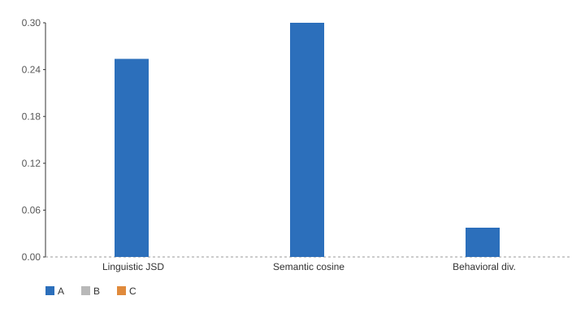
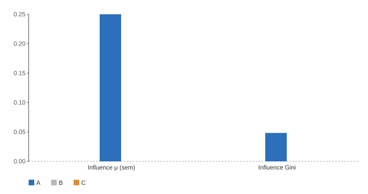

# Emergent Divergence — Report (`alpha02`)

_Generated 2026-06-05T02:56:44.677463+00:00_

## Abstract

This run (`alpha02`) measured emergent behavioral divergence and cross-agent influence among three same-model agents (Proposer / Critic / Synthesizer) coordinating over multi-turn claim-analysis tasks. It analyzed **1 matrix cells** across backends ['ollama'], conditions A/B/C, computing all semantic quantities with a shared `minilm` embedder so the two backends are directly comparable. Total spend was **$0.00**.

- ollama: 0 supported, 3 mixed of 8 hypotheses

## Methods

**Design.** A `backends × conditions × seeds` matrix. Conditions: **A** = memory + weak role priors; **B** = memory disabled (context reset each round) + weak priors; **C** = memory + zero role priors (generic identical agents). Each cell runs independent, checkpointed rounds of two-turn deliberation with starting-agent rotation.

**Divergence metrics.** Linguistic divergence is the windowed mean pairwise Jensen-Shannon divergence (JSD, base 2) of agents' word-frequency distributions; its trend over rounds is a Spearman ρ (H1). Behavioral specialization scores how agents' message-act profiles differ (H2). Semantic divergence is the mean pairwise cosine distance between agent response embeddings (shared `minilm` embedder), with its round-trend as a Spearman ρ (H3).

**Influence-delta.** On every Nth round a counterfactual probe builds a canonical context where each target sees all other agents, generates factual continuations, then re-generates with one source ablated. The influence of source *i* on target *j* is the change between the two continuation pools — semantically (`id_sem`, centroid cosine distance) and lexically (`id_tok`, token-JSD). Aggregated over rounds these form an influence matrix `M[source→target]`; row sums give outgoing influence, `A = M − Mᵀ` gives net directed influence, and the Gini of row sums measures concentration / hub formation (H-I2). A lagged Spearman correlation tests whether influence precedes divergence (H-I3).

**Statistics.** Headline metrics are aggregated over seeds with percentile bootstrap 95% CIs; the memory contrast (A vs B) uses a bootstrap CI on the mean difference plus Cohen's *d*. Each hypothesis verdict is **data-driven**: *Supported* when the relevant CI excludes 0 in the hypothesized direction, *Mixed* when the point estimate points the right way but the CI straddles 0, *Not supported* otherwise.

## Results — backend `ollama`

_1 cells; condition n = {'A': 1, 'B': 0, 'C': 0}_

### Headline metrics (95% bootstrap CI)

| Metric | A | B | C |
| --- | --- | --- | --- |
| Linguistic JSD | 0.256 (n=1) | — | — |
| Semantic cosine | 0.302 (n=1) | — | — |
| Behavioral div. | 0.038 (n=1) | — | — |
| Influence μ (sem) | 0.247 (n=1) | — | — |
| Influence Gini | 0.048 (n=1) | — | — |
| Semantic ρ (trend) | 0.260 (n=1) | — | — |

### Hypothesis verdicts

| Hyp | Verdict | Statement | Evidence |
| --- | --- | --- | --- |
| H1 | **Not supported** | Linguistic divergence increases over rounds (Spearman ρ on pairwise JSD). | -0.143 (n=1) |
| H2 | **Mixed** | Agents specialize behaviorally by role. | 0.038 (n=1) |
| H3 | **Mixed** | Semantic divergence increases over rounds (Spearman ρ on MiniLM cosine). | 0.260 (n=1) |
| H4 | **Insufficient data** | Memory amplifies divergence (condition A > condition B). | — |
| H5 | **Insufficient data** | Divergence occurs even without role priors (condition C). | — |
| H-I1 | **Insufficient data** | Memory amplifies cross-agent influence (A > B). | — |
| H-I2 | **Mixed** | Influence concentrates into a hub (Gini of outgoing influence). | Gini 0.048 (n=1) |
| H-I3 | **Not supported** | Influence precedes divergence (lagged correlation, lag ≥ 1). | proportion 0.0 |

*Divergence metrics by condition — ollama*

*Influence metrics by condition — ollama*

![Influence matrix M[source→target] (condition A) — ollama](figures/influence_heatmap_ollama.svg)
*Influence matrix M[source→target] (condition A) — ollama*

## Cross-backend comparison (condition A)

| Metric | ollama |
| --- | --- |
| Linguistic JSD | 0.256 (n=1) |
| Semantic cosine | 0.302 (n=1) |
| Behavioral div. | 0.038 (n=1) |
| Influence μ (sem) | 0.247 (n=1) |
| Influence Gini | 0.048 (n=1) |

## Hypothesis verdicts (all backends)

| Hyp | Statement | ollama |
| --- | --- | --- |
| H1 | Linguistic divergence increases over rounds (Spearman ρ on pairwise JSD). | Not supported |
| H2 | Agents specialize behaviorally by role. | Mixed |
| H3 | Semantic divergence increases over rounds (Spearman ρ on MiniLM cosine). | Mixed |
| H4 | Memory amplifies divergence (condition A > condition B). | Insufficient data |
| H5 | Divergence occurs even without role priors (condition C). | Insufficient data |
| H-I1 | Memory amplifies cross-agent influence (A > B). | Insufficient data |
| H-I2 | Influence concentrates into a hub (Gini of outgoing influence). | Mixed |
| H-I3 | Influence precedes divergence (lagged correlation, lag ≥ 1). | Not supported |

## Limitations

- **Influence is not manipulation.** The influence-delta measures how much one agent's *presence* changes another's output under ablation. It does **not** measure intent, persuasion, or manipulation, and is never relabelled as such.
- **Small samples.** CIs are bootstrap estimates over a handful of seeds; treat wide intervals and single-seed cells as suggestive, not conclusive.
- **Claude non-determinism.** The paid backend does not honor a generation seed, so its variance is absorbed into the seed-level CIs rather than removed.

## Reproducibility

- **Run id:** `alpha02`
- **Command:** `./run_all.sh` (or `python -m emergent_divergence pipeline`).
- **Config:** `configs/pipeline.yaml` (single source of truth); environment overrides `ROUNDS`/`SEEDS`/`COST_CAP_USD`/`INFLUENCE_EVERY_N`/`K_SAMPLES`.
- **Artifacts:** `results.csv`, `results.json`, `statistics.json`, `cell_reports.json`, `RUN_MANIFEST.json` (full config, prices, per-cell status, actual spend), and these figures.
- **Determinism:** Ollama and the stub honor per-call seeds; the matrix is checkpointed per cell (`status.json`) and resumes without double-counting spend.
